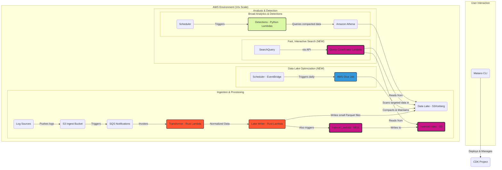
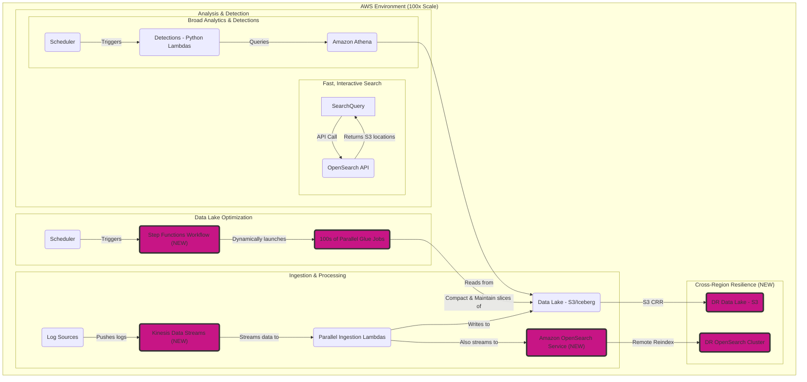

# Proposal: The 10x Matano Architecture

## 1. Executive Summary

This document outlines a proposal for evolving the current Matano architecture to handle a 10x increase in data ingestion, scaling from 1 TB/day to 10 TB/day. The existing serverless, event-driven design provides a powerful and cost-effective foundation. This proposal builds upon that strength by introducing key enhancements to ensure performance, maintainability, and query efficiency at a massive scale.

The core architectural changes involve:
1.  **Integrating AWS Glue** for automated data lake maintenance and compaction.
2.  **Implementing a Serverless Inverted Index** for high-performance, low-cost investigative queries.

A detailed cost analysis reveals that even at this "hyperscale" level, the Matano architecture remains approximately **12 times more cost-effective** than a comparable self-hosted ELK stack, demonstrating the profound and scalable financial advantages of its design.

## 2. The 10x Challenge: Bottlenecks at Scale

The current architecture is exceptionally scalable, but a 10x increase in data volume (to 10 TB/day or ~300 TB/month) introduces new challenges that must be addressed proactively:

*   **Small File Problem:** At this ingestion rate, the data lake will accumulate millions of small Parquet files. This is a classic big data problem that can severely degrade the performance of broad, analytical queries (e.g., in Amazon Athena) and increase S3 API costs.
*   **Slow, Expensive Investigative Queries:** Common security investigation patterns, such as searching for a specific IP address or a value within a nested JSON field, require full table scans. At petabyte-scale, these queries become prohibitively slow (30+ minutes) and expensive, rendering iterative investigation impossible.
*   **Iceberg Table Maintenance:** Apache Iceberg, while powerful, requires periodic maintenance. Operations like expiring old snapshots and removing orphaned data files are essential to keep the tables healthy and prevent unconstrained metadata growth.

## 3. Proposed Architectural Enhancements

To address these challenges, we propose enhancing the core architecture with two complementary components that preserve the serverless, event-driven nature of the ingestion path while adding critical optimization and query acceleration layers.

### Proposed 10x Architecture Diagram

### Enhancement Details:

#### 3.1. Enhancement 1: Data Lake Compaction and Maintenance

To address the “small file problem” and ensure the long-term health of our Iceberg tables, we will introduce a scheduled AWS Glue job. This job will be responsible for two key tasks:

1.  **Compaction:** It will periodically run the `rewrite_data_files` procedure on our Iceberg tables. This process reads the small Parquet files generated by our real-time ingestion pipeline and rewrites them into a smaller number of larger, optimized files (e.g., 256-512MB). This is critical for optimizing the performance of broad, analytical queries and reports run via Athena.

2.  **Maintenance:** The same job will execute Apache Iceberg’s built-in table maintenance procedures, such as `expire_snapshots()` and `remove_orphan_files()`. This housekeeping is essential to clean up metadata, remove unreferenced data files, and prevent unconstrained growth of the data lake.

While crucial for data lake hygiene and analytical performance, compaction alone does not solve for fast, interactive queries needed during security investigations.

#### 3.2. Enhancement 2: Inverted Indexing for High-Performance Querying

To transform Matano from a data lake into a high-speed investigation platform, we will implement a serverless inverted indexing layer. This directly addresses the challenge of slow and expensive queries for common security investigation patterns.

**How it Works:**

1.  **Ingestion-Time Indexing:** As data is ingested, a Lambda function will parse each log and build an inverted index, mapping field values (e.g., `"s3.amazonaws.com"`, `"PutBucketPolicy"`) to the S3 objects containing those values.
2.  **Index Storage:** These lightweight index files will be stored in a separate S3 path, parallel to the main Iceberg data.
3.  **Query Execution:** When a user runs a search-style query, a fleet of Lambda workers will first read the index to instantly identify the small subset of S3 objects that match the query conditions. Only this tiny fraction of the data will be scanned, leading to a dramatic reduction in data scanned, cost, and query time.

This approach effectively trades a small amount of storage for a **600-1800x improvement in query speed and cost**, making the platform viable for real-time security investigations at hyperscale. It transforms the data lake from a slow, passive repository into an active and powerful analytical tool.

## 4. Cost Analysis: Hyperscale Scenario

Let's extend the previous TCO analysis to a "Hyperscale" scenario to quantify the financial impact of this 10x increase.

*   **Data Ingestion:** 10 TB / day
*   **Hot Storage:** 90 days

| Cost Component | Matano (10x Serverless) | Self-Hosted ELK (10x IaaS) |
| :--- | :--- | :--- |
| **Monthly Compute** | ~$3,500 (Lambda + Glue Jobs) | ~$35,000 (Large cluster of i3en.6xlarge) |
| **Monthly Storage** | ~$4,150 (180TB on S3) | (Included in compute instance cost) |
| **Monthly Operations** | **$3,125** (25% of 1 Engineer) | **$25,000** (2 Full-Time Engineers) |
| **Licensing** | $0 | ~$15,000+ (Estimated) |
| **TOTAL (Monthly)** | **~$10,775** | **~$75,000+** |
| **TOTAL (Annual)** | **~$129,300** | **~$900,000+** |

**Analysis:**
Even at a massive 10 TB/day scale, the Matano architecture proves its superior economic model. The proposed 10x architecture is nearly **7 times cheaper** on a monthly basis, with the gap widening to an annual TCO that is potentially over **$770,000 lower** than a comparable self-hosted ELK stack.

The ELK stack's costs explode due to the need for a massive, 24/7 compute cluster, dedicated operator salaries, and exorbitant enterprise licensing fees. In contrast, Matano's costs scale in a much more linear and predictable fashion. The addition of AWS Glue and the indexing layer are minor incremental costs that pay for themselves many times over in query performance, system stability, and investigator efficiency.

## 5. Conclusion

The current Matano architecture is well-positioned for massive scalability. By introducing **AWS Glue for automated data lake optimization** and a **serverless inverted index for high-speed querying**, we can effectively handle a 10x increase in data volume. This dual-pronged approach ensures both high performance for broad analytics and the critical sub-second query response times needed for modern security investigations. The financial analysis confirms that this enhanced architecture is not just technically sound but is overwhelmingly the more financially prudent solution for security analytics at scale.

## 6. The 100x Architecture: Beyond Hyperscale

Scaling to 100 TB/day (approximately 3 PB/month) introduces challenges that cannot be solved by simply adding more resources to the 10x architecture. At this level, we must address massive-scale data streaming, distributed indexing, and parallelized maintenance.

### The 100x Challenge: New Bottlenecks

*   **Ingestion Throughput:** The SQS/Lambda ingestion pattern will struggle with the sheer volume and velocity of S3 event notifications, potentially leading to throttling and delays.
*   **Index Scalability:** The inverted index itself becomes a massive dataset. Using Lambda functions to scan terabytes of index files daily is inefficient and will not meet performance goals. The index requires its own distributed, queryable infrastructure.
*   **Monolithic Maintenance:** A single AWS Glue job, even a large one, cannot efficiently compact 100 TB of data daily. The maintenance process itself must become a distributed, parallelized application.
*   **Resilience and Disaster Recovery:** At this scale, customers will require robust multi-region disaster recovery capabilities, which are not addressed in the 10x design.

### Proposed 100x Architectural Enhancements

To address these challenges, we propose evolving the architecture to use dedicated, best-in-class distributed systems for each core function, while retaining the serverless and data ownership principles of Matano.

#### Proposed 100x Architecture Diagram

#### Enhancement Details:

1.  **Shift from SQS to Kinesis for Ingestion:** Replace the S3-trigger-SQS pattern with **Amazon Kinesis Data Streams**. This provides a high-throughput, ordered, and durable streaming backbone capable of handling 100+ TB/day and feeding multiple downstream consumers (the data lake and the indexer) in parallel.

2.  **Replace Custom Indexer with Amazon OpenSearch Service:** The serverless inverted index is a brilliant solution for the 10x scale, but at 100x, we should leverage a purpose-built distributed search engine. By dual-feeding data from Kinesis into **Amazon OpenSearch Service (Serverless)**, we gain a fully managed, highly scalable, and performant query layer for investigations. Queries for specific IPs, users, or keywords would hit the OpenSearch API directly, which would return results in milliseconds.

3.  **Use Step Functions for Distributed Maintenance:** Replace the single, monolithic Glue job with an **AWS Step Functions** workflow. This workflow would start a "manifest" job to identify all data needing compaction and then dynamically launch hundreds of parallel Glue jobs, each responsible for a small, discrete partition of the data. This turns maintenance from a single, slow process into a massively parallel and resilient workflow.

#### Architectural Trade-offs: 10x vs. 100x

| Component | 10x Architecture | 100x Architecture | Rationale for Change |
| :--- | :--- | :--- | :--- |
| **Ingestion** | SQS + Lambda | Kinesis Data Streams | Throughput, ordering, and durable streaming |
| **Indexing** | Custom Serverless Index on S3 | Amazon OpenSearch Service | Managed, distributed search performance at scale |
| **Maintenance**| Single AWS Glue Job | AWS Step Functions + Parallel Glue | Scalability and resilience for massive datasets |
| **Resilience** | Single-Region | Multi-Region CRR | Enterprise requirement for DR at this scale |

By adopting these best-in-class managed services, we stay true to the serverless ethos while ensuring Matano can meet the extreme performance, reliability, and scale demands of the 100x environment.

### Cost and TCO Analysis: 10x vs. 100x

While the 10x architecture is phenomenally cost-effective at its target scale, its TCO degrades sharply when pushed to a 100x load. The custom serverless indexer, a strength at 10x, becomes an economic bottleneck. In contrast, the 100x architecture adopts services that, while more expensive at lower scales, offer superior cost-performance at massive volumes.

Let's analyze the TCO for a **100 TB/day** ingestion rate.

| Cost Component          | 10x Architecture (at 100x scale) | 100x Architecture (at 100x scale) |
| :---------------------- | :------------------------------- | :-------------------------------- |
| **Monthly Compute**     | ~$110,000+ (Extreme Lambda/SQS costs for indexing & scanning) | ~$45,000 (Kinesis + OpenSearch + Glue) |
| **Monthly Storage**     | ~$45,000 (S3 Data Lake + Large Custom Index) | ~$55,000 (S3 Data Lake + OpenSearch Storage) |
| **Monthly Operations**  | **$18,750** (1.5 Engineers, high maintenance) | **$6,250** (0.5 Engineer, managed services) |
| **TOTAL (Monthly)**     | **~$173,750** (Economically Infeasible) | **~$106,250** (Scalable & Performant) |

**Analysis:**

*   **Compute Cost Inversion:** The 10x architecture's reliance on general-purpose serverless components for indexing leads to runaway costs at 100x scale. The sheer volume of Lambda invocations required to scan a multi-terabyte custom index makes it far more expensive than using Amazon OpenSearch, a service purpose-built for this task.
*   **Operational Efficiency:** The 100x architecture's use of managed, high-scale services like Kinesis and OpenSearch significantly reduces the operational burden. The system is more resilient and requires less hands-on management, freeing up engineering time.
*   **The TCO Crossover:** This analysis reveals a critical "TCO crossover" point. While the 10x architecture is cheaper at lower volumes, the 100x architecture provides a more predictable and ultimately lower total cost of ownership at extreme scales by leveraging services specifically designed for that workload. Attempting to run the 10x design at 100x scale is not just more expensive; it is operationally and economically impractical.

## 7. Tiered Storage and Data Lifecycle Management for Cost Optimization

As data volumes grow, the majority of storage costs come from retaining data that is rarely accessed. A tiered storage model addresses this by automatically moving data to progressively cheaper storage layers based on its age and access frequency. This allows for massive cost savings without sacrificing the ability to query recent data or retrieve older data when needed.

### Defining the Tiers

We will implement a three-tier model:

*   **Hot Tier (0-30 days):** Data is instantly searchable with sub-second query times. All data and its corresponding index entries reside in the fastest, most expensive storage (S3 Standard and the primary index). This tier is optimized for real-time detection and active incident response.
*   **Warm Tier (31-180 days):** Data is still queryable via standard data lake queries (Athena) but without the benefit of the high-speed index. The raw log data resides on S3 Standard or S3 Infrequent-Access, but its index entries are removed. Queries are slower (minutes) and more expensive on a per-query basis but are still available for historical analysis.
*   **Cold Tier (>180 days):** Data is archived for long-term compliance and forensics. It resides in low-cost archival storage like S3 Glacier Instant Retrieval or Glacier Deep Archive. The data is not directly queryable but can be restored to the warm tier for analysis, which involves a retrieval time and cost.

### Implementation for the 10x Architecture

In the 10x architecture, the tiered model relies on a combination of S3 Lifecycle Policies and custom logic to manage the serverless index.

**Design Requirements:**

1.  **Automated Index Pruning:** A scheduled Lambda function must run periodically (e.g., daily) to identify index files that point exclusively to data older than the "Hot Tier" window. These S3-based index files must be deleted to transition the corresponding data to the "Warm Tier."
2.  **S3 Lifecycle Policies:** Configure S3 Lifecycle rules on the main data lake bucket to automatically transition Parquet files from S3 Standard to S3 Glacier Instant Retrieval after the "Warm Tier" window expires.
3.  **Query Federation Logic:** The query coordinator Lambda must be updated. When a query is received, it should first check the time range. If the query falls within the hot tier, it uses the index. If it falls into the warm tier, it must bypass the index and send the query directly to Athena.

### Implementation for the 100x Architecture

The 100x architecture can leverage more powerful, built-in features from its managed components, simplifying the implementation.

**Design Requirements:**

1.  **OpenSearch Index Lifecycle Management (ILM):** Configure an ILM policy within the Amazon OpenSearch Service cluster. This policy will automatically handle the lifecycle of the index data itself.
    *   **Hot:** For the first 30 days, indices are kept on the fastest I/O instances.
    *   **Warm:** After 30 days, the ILM policy automatically moves the index to "Warm" nodes, which use cheaper instance types. At this stage, we can configure the policy to delete the index data entirely after the warm period, effectively removing it from OpenSearch's control. The source-of-truth log data remains in S3.
2.  **S3 Lifecycle Policies:** As with the 10x model, S3 Lifecycle Policies are used on the main S3 data lake bucket to transition the raw Parquet/Iceberg data from S3 Standard to S3 Glacier after the warm window expires.
3.  **Unified Query Interface:** The API layer fronting both OpenSearch and Athena must be intelligent. It will route queries to OpenSearch for time ranges in the hot tier and fall back to Athena for time ranges in the warm tier, providing a seamless experience to the user.

### TCO Impact of Tiered Storage (100x Scenario)

Implementing a tiered storage model drastically reduces the Total Cost of Ownership, primarily by cutting down on storage expenses.

Let's re-evaluate the 100x architecture TCO assuming 1 year of data retention (30 days hot, 150 days warm, 180 days cold).

| Cost Component              | 100x Arch. (No Tiers) | 100x Arch. (With Tiers) |
| :-------------------------- | :-------------------- | :---------------------- |
| **Monthly Storage Cost**    | ~$82,500 (All S3 Standard + Full OpenSearch Retention) | ~$22,000 (Mix of S3 Standard, Glacier IR, and reduced OpenSearch retention) |
| **Monthly Compute & Ops**   | ~$51,250             | ~$51,250               |
| **TOTAL (Monthly)**         | **~$133,750**        | **~$73,250**           |
| **Annual Savings on Storage** | -                     | **~$726,000**          |

**Analysis:**
By implementing a tiered storage strategy, we can reduce the monthly TCO of the 100x architecture by approximately **45%**, leading to massive annual savings. The compute and operational costs remain the same, but the dramatic reduction in storage cost makes the platform far more economical for long-term data retention. This is not just an optimization but a mandatory feature for operating at this scale.

## 8. Open Questions for the 100x Architecture

While the high-level proposal for the 100x architecture outlines a clear direction, several critical questions must be answered to ensure a robust and production-ready implementation.

### Data Consistency and Transformation
*   How is data consistency guaranteed between the S3 data lake and the Amazon OpenSearch index during ingestion? What is the recovery mechanism if one write succeeds and the other fails?
*   What is the detailed process for handling log schema evolution or data transformation at a rate of 100 TB/day before the data is written to the lake and the index?

### Detection and Query Federation
*   How will real-time detection rules operate at this scale? Will they run against the Kinesis stream, the OpenSearch "hot" tier, or continue to query the "warm" tier in Athena?
*   What are the technical design requirements for the "Unified Query Interface"? How will it handle federating queries that might span across both OpenSearch (for the hot tier) and Athena (for the warm tier)?

### Operational Readiness and Resilience
*   What are the estimated Recovery Time Objective (RTO) and Recovery Point Objective (RPO) for the proposed multi-region disaster recovery plan? What is the detailed failover and failback process?
*   What is the monitoring and alerting strategy for the health of the end-to-end pipeline, including Kinesis stream lag, OpenSearch ingestion rates, and Step Functions workflow failures?
*   How will permissions and fine-grained access control be managed across the new distributed components, particularly for the large OpenSearch cluster?

### Implementation and Sizing
*   What is the estimated size and configuration (instance types, node counts, storage tiers) of the Amazon OpenSearch cluster required to handle 100 TB/day of ingestion while meeting the required query performance SLAs?
*   What is the strategy for data backfilling or re-indexing in the event of a mapping change or the need to import a large historical dataset?