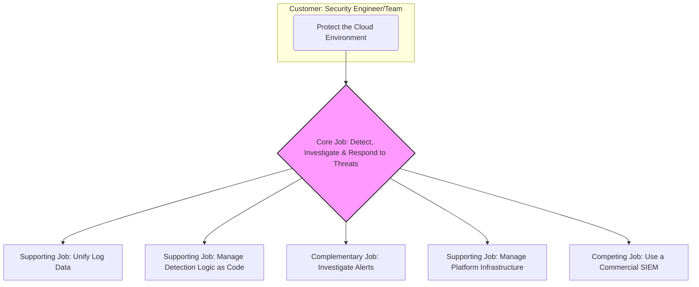
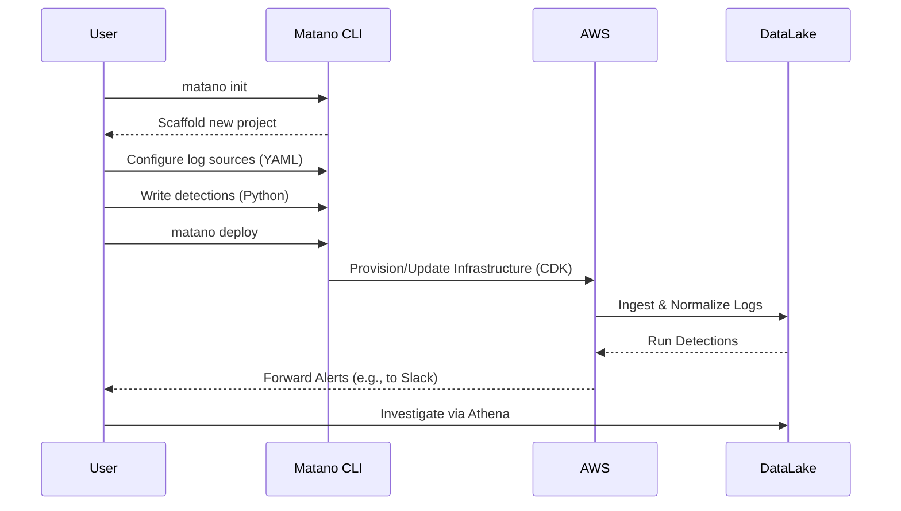

# Jobs to be Done (JTBD) Documentation: Matano

This document outlines the "Jobs to be Done" that customers hire the Matano platform to perform. It is based on an analysis of the Matano source code and inferred product functionality.

## 1. Core Job Definition

The primary job customers hire Matano for can be defined as:

**When** my organization's cloud environment is constantly changing and generating vast amounts of log data, **I want to** proactively detect, investigate, and respond to security threats in a scalable and cost-effective way, **so I can** reduce security risk and protect our assets without being burdened by the overhead of traditional security tools.

## 2. Job Map

This diagram illustrates the relationship between the core job and the supporting jobs required to accomplish it.



## 3. Related Jobs & Desired Outcomes

### Supporting Jobs
These are jobs that make it easier to accomplish the core job.

*   **Job:** Unify disparate log data from many sources.
    *   **Desired Outcome:** Decrease the time it takes to onboard a new log source by 50%.
    *   **Desired Outcome:** Ensure 100% of ingested log data is normalized to a common, queryable schema (ECS).

*   **Job:** Manage security infrastructure efficiently.
    *   **Desired Outcome:** Minimize the operational cost of the security analytics platform by leveraging serverless technology.
    *   **Desired Outcome:** Manage the entire platform deployment and configuration through version-controlled code (IaC).

*   **Job:** Keep detection logic up-to-date and relevant.
    *   **Desired Outcome:** Reduce the time it takes to write and deploy a new detection from days to minutes.
    *   **Desired Outcome:** Enable a collaborative, code-based workflow for creating and reviewing detection logic.

### Complementary Jobs
These jobs are often done in conjunction with the core job.

*   **Job:** Investigate the root cause of security alerts.
    *   **Desired Outcome:** Reduce the Mean Time to Investigate (MTTI) an alert.
    *   **Desired Outcome:** Access enriched, normalized data directly in a data lake for ad-hoc analysis without data movement.

### Competing Jobs
These are alternative solutions a customer might hire.

*   **Job:** Purchase and manage a commercial SIEM product (e.g., Splunk, Datadog).
    *   **Why Matano is Hired Instead:** To significantly reduce the total cost of ownership (TCO) for security analytics.
    *   **Why Matano is Hired Instead:** To avoid vendor lock-in and retain full ownership and control over security data.

## 4. User Progress Diagram

This diagram illustrates the steps a customer takes to get the core job done with Matano, from initial setup to investigation.



## 5. Outcome Hierarchy

This diagram shows how the desired outcomes from using Matano contribute to the overall value proposition for the customer.

```mermaid
graph TD
    A(Reduce Organizational Security Risk)
    A --> B(Faster Threat Detection & Response)
    B --> C(Reduce Mean Time to Detect - MTTD)
    B --> D(Automate Detection Runs against Normalized Data)

    A --> E(Lower TCO for Security Analytics)
    E --> F(Leverage Serverless & Data Lake Economics)
    E --> G(Reduce Manual Operational Work via IaC)

    A --> H(Empower Security Team)
    H --> I(Enable Flexible "Detections as Code")
    H --> J(Provide Full Data Ownership & Query Flexibility)
```
