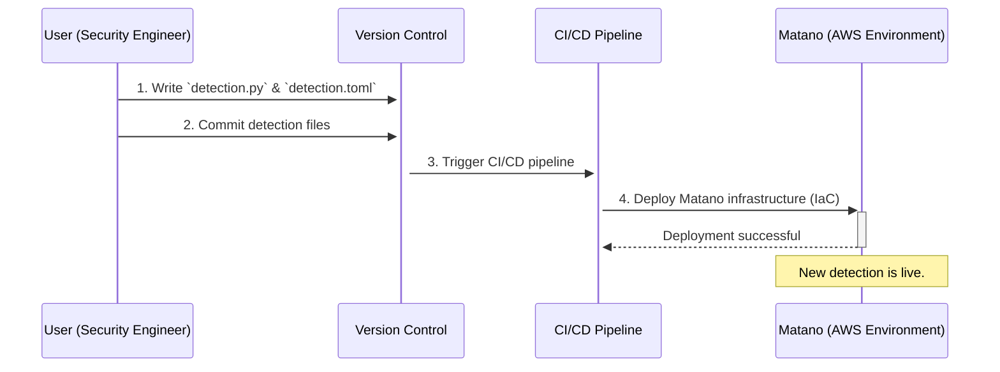
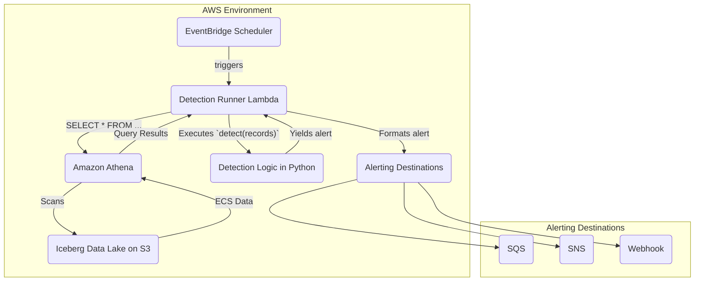

# TRD: Detections in Matano

## 1. Overview and Objective

This document provides the technical requirements and design for the detection and alerting capabilities within the Matano platform. The primary objective is to enable a **collaborative, code-based, and rapid workflow** for creating and managing security detections.

As defined in the project's "Jobs to Be Done," this system is designed to "reduce the time it takes to write and deploy a new detection from days to minutes." It achieves this by treating detection logic as code, which can be version-controlled, reviewed, and deployed automatically alongside the infrastructure.

## 2. The Detection Lifecycle

From the user's perspective, creating and deploying a detection follows a modern DevOps workflow. This process is designed to be fast, repeatable, and transparent.

### 2.1. User Workflow

### 2.2. System and Data Flow

## 3. Anatomy of a Detection

A Matano detection consists of two files: a TOML file for configuration and a Python file for the logic.

### 3.1. Configuration (`detection.toml`)

This file defines the detection's metadata, controlling how it is run, how alerts are generated, and what context is provided to analysts.

### 3.2. Logic (`detection.py`)

This Python file contains the core detection logic in a function named `detect`. It takes a list of ECS-normalized records and yields a dictionary for each match.

## 4. The Role of Amazon Athena in Detections

As shown in the system diagram, Amazon Athena is the query engine that sits between the Detection Runner Lambda and the data lake. It is the component responsible for fetching the raw data that will be analyzed by the Python detection logic. Its selection is a critical design choice.

### 4.1. Why Athena?

Matano uses Athena for several key reasons that align with the platform's core principles:

1.  **Serverless and Zero-Ops:** Athena is a fully managed, serverless query service. There are no servers to provision, manage, or scale. This perfectly aligns with Matano's zero-ops philosophy, eliminating operational overhead for the user.
2.  **Decoupled Compute and Storage:** Athena queries data directly from its location in Amazon S3. This decoupling is the cornerstone of the security data lake model, allowing compute (Athena) and storage (S3) to scale independently and providing full data ownership.
3.  **Native Iceberg Support:** Athena has first-class support for Apache Iceberg tables. This allows Matano to leverage Iceberg's powerful features, such as partition pruning and time travel queries, for improved performance and cost savings, directly from a standard SQL interface.
4.  **Pay-per-Query Model:** The cost model is based on the amount of data scanned by each query. This is highly cost-effective for the scheduled nature of detections, as you only pay for compute when a detection is actively running.

### 4.2. Pros, Cons, and Risks

| | Detail |
| :--- | :--- |
| **Pro: No Infrastructure** | As a serverless AWS service, all management, patching, and scaling is handled automatically. |
| **Pro: Scalability** | Athena can transparently scale to query petabytes of data without any user intervention. |
| **Pro: Open Standards** | It works directly with open data formats (Parquet, Iceberg) and the AWS Glue Data Catalog, preventing lock-in at the storage layer. |
| **Con: Query Latency** | Athena is designed for analytical queries, not OLTP. Query startup and execution can take several seconds, which makes it unsuitable for sub-second, real-time use cases on its own. |
| **Con: Concurrency Limits** | AWS accounts have default concurrency limits for Athena. A very large Matano deployment running hundreds of complex detections simultaneously could potentially hit these limits. |
| **Risk: Cost Overruns** | The biggest risk. A poorly written detection that does not specify filters (`SELECT * FROM table`) can result in a full table scan, leading to unexpectedly high costs. This risk must be managed by enforcing query best practices, such as partition pruning and pre-filtering (see Section 5.3). |
| **Risk: AWS Lock-in** | While the data itself is open, the query engine is a proprietary AWS service. Migrating the detection execution framework to another cloud would require replacing Athena with an alternative like Spark, Trino, or BigQuery. |

## 5. Conclusion

The Matano detection framework is designed to empower security teams by transforming detection into a structured, code-based workflow. By combining simple Python with declarative TOML configuration and a serverless execution model, it provides a powerful, scalable, and highly efficient system for finding and responding to threats in real time.

## 6. Potential 10x Improvements

### 6.1. Interactive Detection Testing
Reduce the developer feedback loop from minutes to seconds with a CLI tool for live, interactive testing against historical data.

### 6.2. Real-time Streaming Detections
Introduce a `realtime = true` option to deploy detections to a low-latency streaming architecture, reducing Mean Time to Detect from hours to seconds.

### 6.3. Pre-filtering with Query Pushdown
Add a `[query]` table to `detection.toml` to specify a `where` clause. This would push filtering down to Athena, dramatically reducing the amount of data scanned and improving both performance and cost.

### 6.4. Automated Backtesting in CI/CD
Integrate detection backtesting into the CI/CD pipeline to simulate the impact of a new rule against historical data, preventing noisy alerts from reaching production.

### 6.5. Community Detections Registry
Create a public registry of pre-built, community-maintained detections that users can easily enable, providing immediate value for new Matano deployments.
