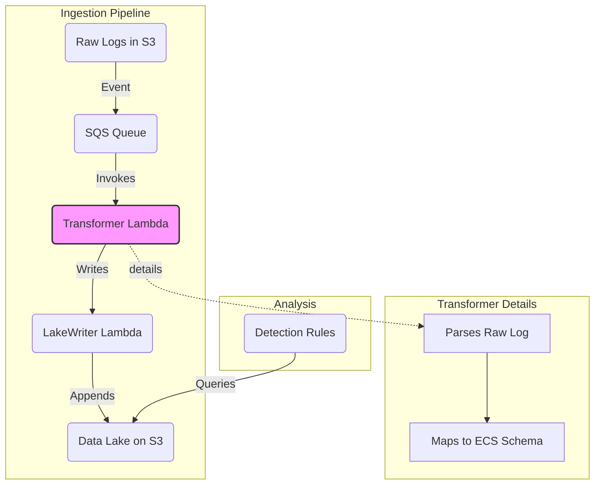

# TRD: Open Standards (Elastic Common Schema) in Matano

## 1. Overview and Objective

This document provides the technical requirements and strategic rationale for Matano's use of the **Elastic Common Schema (ECS)** for data normalization. While Apache Iceberg provides the open standard for the *storage format*, ECS provides the open standard for the *data schema* itself. 

The primary objective of using ECS is to create a **unified language for security data**. By normalizing disparate log sources (e.g., AWS CloudTrail, Okta, Microsoft 365) to a common schema, Matano enables analysts to write source-agnostic detections and perform cross-source correlation far more effectively.

## 2. Why Elastic Common Schema (ECS)?

Normalizing data is a prerequisite for effective security analytics. The choice of ECS as the standard is based on several key factors:

1.  **Open and Community-Driven:** ECS is an open-source specification with a vibrant community led by Elastic.
2.  **Designed for Security Analytics:** ECS was purpose-built for security use cases, providing a rich set of fields for hosts, networks, users, and processes.
3.  **Industry Adoption:** As a widely adopted standard, many security engineers are already familiar with ECS, reducing the learning curve.
4.  **Extensibility:** ECS provides a well-defined base schema but is also designed to be extensible, allowing Matano to add custom fields without breaking compatibility.

## 3. ECS in the Matano Architecture

The ECS normalization process is a core part of the Matano ingestion pipeline and is handled by the `Transformer` Lambda function.

### 3.1. Data Flow and Normalization

The journey from raw log to a queryable ECS record follows these steps:

1.  **Ingestion:** A raw log file lands in an Amazon S3 bucket.
2.  **Trigger:** An S3 event notification places a message onto an SQS queue.
3.  **Transformation:** The `Transformer` Lambda, written in high-performance Rust, is invoked by the SQS message. This is where ECS normalization occurs.
4.  **Parsing:** The `Transformer` uses a specific parser for the log source (e.g., a CloudTrail parser). 
5.  **Mapping:** The parser's sole responsibility is to map the fields from the raw log into the structured ECS format. For example, in an AWS CloudTrail log, the field `userIdentity.arn` is mapped to the ECS fields `user.id`, `user.arn`, and `user.domain`.
6.  **Loading:** The normalized, ECS-compliant data is then passed to the `LakeWriter` Lambda, which writes the record into the Apache Iceberg data lake.

### 3.2. System Diagram

This diagram illustrates the flow, with the `Transformer` Lambda serving as the central component for data normalization.



### 3.3. Detections on ECS Data

All detections in Matano are written in Python and run against the ECS-structured data in the Iceberg data lake. Because the `Transformer` has already done the hard work of normalization, the detection logic can be simple, powerful, and reusable.

An engineer can write a single Python function to detect a suspicious pattern, and it will work for *any* log source that contains the relevant ECS fields.

**Example: Source-Agnostic Brute-Force Detection**

A detection for a brute-force login attack needs to know three things: the user being targeted, the source IP of the attack, and that the event was a failure. In ECS, these are `user.name`, `source.ip`, and `event.outcome`.

An engineer can write a simple detection like this:

```python
# pseudo-code for a matano detection
from collections import Counter

THRESHOLD = 10

def detect(records):
    # records is a list of ECS-compliant dictionaries
    failures = Counter(
        (
            r.get("user", {}).get("name"),
            r.get("source", {}).get("ip"),
        )
        for r in records
        if r.get("event", {}).get("outcome") == "failure"
    )

    for (user, ip), count in failures.items():
        if user and ip and count > THRESHOLD:
            yield {
                "title": f"Potential brute-force attack on {user} from {ip}",
                "user": user,
                "source_ip": ip,
                "count": count
            }
```

This single piece of logic works seamlessly across Okta logs, AWS console login logs, and SSH logs, because they have all been normalized to the same ECS fields.

## 4. Key Use Cases Enabled by ECS

*   **Source-Agnostic Detections:** Write one rule to detect a threat pattern and apply it to multiple, disparate log sources.
*   **Simplified Incident Investigation:** Query data using consistent field names (`user.name`, `source.ip`) regardless of the original log source, dramatically reducing cognitive load.
*   **High-Fidelity Correlation:** Confidently correlate user activity across cloud, endpoint, and application logs.
*   **Sharable Detection Logic:** Build and share detection rules within the open-source community that are instantly usable.

## 5. Pros and Cons

| Pros | Cons |
| :--- | :--- |
| **Enables Reusable Detections:** Drastically reduces the effort required to write and maintain detection logic. | **Mapping Overhead:** Every new log source requires engineering effort to build and maintain a mapping from its raw format to ECS. |
| **Simplifies Analysis:** Provides a consistent query experience across all data sources. | **Potential for Misinterpretation:** A field in a raw log may not have a perfect 1:1 mapping in ECS, requiring careful interpretation. |
| **Leverages Industry Standard:** Reduces the learning curve for analysts and allows for community sharing. | **Schema Rigidity:** While extensible, changes to the core schema are governed by the ECS community and may take time. |

## 6. Conclusion

The adoption of the Elastic Common Schema is, alongside Apache Iceberg, a foundational pillar of the Matano platform. The upfront investment in normalizing every log source is a deliberate and necessary trade-off that enables the platform's core jobs: writing powerful, source-agnostic detections and simplifying complex investigations.
