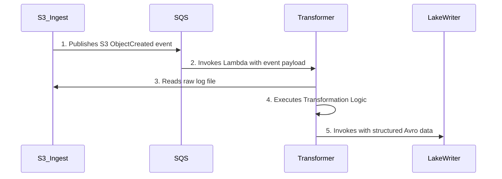
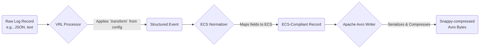

# TRD: The Matano Transformer

## 1. Document Overview
This document provides the technical requirements for the Matano Transformer. The Transformer is a critical component in the Matano data pipeline responsible for converting raw, unstructured log data into structured, queryable data normalized to the Elastic Common Schema (ECS).

## 2. Objective
The primary objective of the Transformer is to provide a high-performance, scalable, and reliable mechanism for processing log data from a multitude of sources. It ensures that all data entering the Matano data lake is clean, structured, and conforms to a unified schema, which is essential for effective downstream detection and analysis.

## 3. System Diagrams

### User Flow Diagram
A user (Security/DevOps Engineer) does not interact with the Transformer directly. Instead, they define its behavior by configuring log sources and deploying them.

```mermaid
graph TD
    A[User defines log source config<br>(e.g., cloudtrail.yml)] -- `matano deploy` --> B(Matano CLI);
    B -- Synthesizes & Deploys --> C(AWS CDK);
    C -- Creates/Updates --> D{AWS Resources};
    subgraph D
        E[S3 Log Source Bucket]
        F[SQS Topic]
        G[Transformer Lambda Config]
    end
```

### System Flow Diagram
This diagram shows the Transformer's place in the data pipeline at runtime.



### Data Flow Diagram
This diagram illustrates the journey of a single log record within the Transformer.



## 4. Log Sources and Transformations

The Transformer is designed to handle any log source defined by a user. A `transform` expression, written in Vector Remap Language (VRL), is specified in the log source's configuration file to perform the parsing and structuring.

| Log Source | Example Raw Data Format | Transformation Goal |
| :--- | :--- | :--- |
| **AWS CloudTrail** | JSON | Parse JSON, map fields like `eventName`, `userIdentity`, and `sourceIPAddress` to corresponding ECS fields (`aws.cloudtrail`, `event.action`, `user.name`, `source.ip`). |
| **Okta** | JSON | Parse JSON, normalize actor, client, and outcome fields to ECS. Map `eventType` to `event.action`. |
| **Zeek** | TSV (Tab-Separated) | Parse the TSV format, assign headers, and map connection data (e.g., `id.orig_h`, `id.resp_p`) to ECS source/destination fields. |
| **Suricata** | JSON (Eve) | Parse nested JSON objects. Map fields like `event_type`, `src_ip`, `dest_port`, and `alert.signature` to their ECS equivalents. |
| **Enrichment Tables** | JSON | This is a special passthrough case, identified by the `enrich_` prefix. No timestamp is required, and minimal transformation is applied before writing to the data lake for lookup purposes. |

## 5. Functional Requirements

- **FR-1: Consume from SQS:** The Transformer MUST be invoked by and be able to process event messages from an SQS queue.
- **FR-2: Read from S3:** It MUST be able to read the log file(s) from S3 as specified in the SQS message.
- **FR-3: Apply VRL Transforms:** It MUST apply the VRL `transform` expression defined in the corresponding log source configuration.
- **FR-4: Normalize to ECS:** It MUST normalize the structured output of the VRL transform to the Elastic Common Schema.
- **FR-5: Handle Passthrough Tables:** It MUST correctly identify and handle enrichment tables (prefixed with `enrich_`) which have different processing requirements (e.g., no required timestamp).
- **FR-6: Serialize to Avro:** The final records MUST be serialized into the Apache Avro format.
- **FR-7: Compress Output:** The Avro output MUST be compressed using the Snappy codec to optimize storage.
- **FR-8: Batching:** The Transformer MUST batch processed records into optimal file sizes (around 10MB) before invoking the next stage of the pipeline to ensure efficient writes to the data lake.

## 6. Non-Functional Requirements

- **NFR-1: Performance:** The Transformer must be highly performant, capable of processing high volumes of log data with low latency. This requirement justifies the use of Rust.
- **NFR-2: Scalability:** The architecture must be horizontally scalable. As log volume increases, AWS Lambda should automatically scale out the number of concurrent Transformer executions.
- **NFR-3: Reliability:** The system must be resilient to transient failures. The use of an SQS queue for invocation provides an automatic retry mechanism.
- **NFR-4: Maintainability:** The code must be well-structured and documented to allow for future enhancements and bug fixes.
