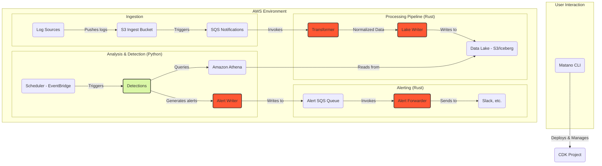
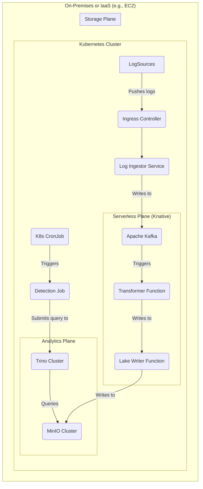

# Matano Technical Architecture

## 1. Architecture Overview

Matano is an open-source, cloud-native security analytics platform built on a serverless, event-driven architecture. It is designed to run entirely within a user's AWS account, leveraging a data lake model to provide a scalable and cost-effective alternative to traditional SIEMs.

The core architectural pattern is a data pipeline that processes logs in a streaming fashion. Log data is ingested, normalized into the Elastic Common Schema (ECS), enriched, and stored in an Apache Iceberg data lake on Amazon S3. Detections, written in Python, are executed against this structured data, and alerts are forwarded to configured destinations.

The entire platform is managed as code using the AWS CDK, enabling automated deployment, versioning, and management through the Matano CLI.

## 2. Use Cases

...

---

## Appendix: Open-Source Alternative Architecture

The Matano architecture is powerful because it seamlessly integrates best-in-class open-source data technologies (Iceberg, Parquet, Avro) with the operational efficiency of managed cloud services. However, it is possible to build a conceptually similar pipeline using a pure open-source stack. This approach provides maximum portability but comes at the cost of significantly increased operational complexity and TCO.

### Component Mapping

| Matano (AWS Managed) | Pure Open-Source Alternative | Description |
| :--- | :--- | :--- |
| **AWS S3** | **MinIO** | An S3-compatible object storage system that would need to be run on a cluster of servers. |
| **AWS SQS** | **Apache Kafka** | A distributed streaming platform, more powerful but also far more complex to manage than SQS. |
| **AWS Lambda** | **Kubernetes + Knative/OpenFaaS** | A container orchestration platform with a serverless framework. Requires managing a full K8s cluster. |
| **AWS EventBridge** | **Kubernetes CronJob / Argo Events** | A job scheduler running within the Kubernetes cluster. |
| **Amazon Athena** | **Trino (PrestoSQL) or Apache Spark** | A distributed query engine. Would require its own dedicated cluster for analytics. |
| **AWS CDK** | **Terraform + Helm Charts** | A combination of tools to provision the underlying virtual machines and deploy the applications to Kubernetes. |

### Alternative Architecture Diagram

This diagram illustrates what such a self-hosted, open-source stack might look like.

### Trade-Offs and Conclusion

-   **Flexibility:** This pure open-source approach is vendor-agnostic and can be deployed on any cloud or on-premises. This is its primary advantage.
-   **Operational Burden:** The user is now responsible for the uptime, scaling, security, and maintenance of every component. This includes managing multiple complex, distributed systems: Kubernetes, Kafka, MinIO, and Trino. The operational cost, measured in engineering salaries and time, would be **orders of magnitude higher** than the cost of the AWS services that Matano replaces.
-   **TCO:** While there are no direct cloud service fees for the software, the Total Cost of Ownership (TCO) would be significantly higher. The cost of the underlying virtual machines needed to run these services 24/7, combined with the salaries of the dedicated engineers required to manage them, would far exceed the pay-per-use model of Matano's serverless architecture.

In conclusion, while a pure open-source alternative is technically feasible, it represents a significant step backward in terms of operational efficiency and cost-effectiveness. Matano's key innovation is the fusion of open-source data standards with a serverless operational model, delivering the benefits of a modern data platform without the crippling operational overhead of managing one.
