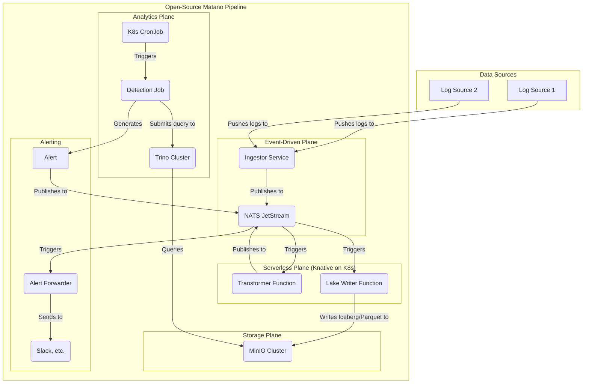

A great way to better understand the existing architecture is to compare it to an alternative approach. Here is a proposal for an architecture that uses an open-source stack, with NATS JetStream and MinIO as the core components.

### Proposal: Open-Source Architecture with NATS JetStream and MinIO

This proposal outlines an alternative architecture for the Matano pipeline, built entirely on open-source technologies. This approach prioritizes portability and avoids vendor lock-in by replacing managed cloud services with self-hosted components. The core of this architecture relies on NATS JetStream for event streaming and MinIO for object storage.

#### **Core Components:**

*   **Ingestion:** Similar to the primary architecture, data is ingested from various sources. An Ingestor Service receives the data and publishes it to the event stream.
*   **Event Streaming:** **NATS JetStream** serves as the central nervous system of the pipeline, replacing AWS SQS and SNS. It provides a durable, at-least-once delivery mechanism for events, ensuring that data is not lost.
*   **Object Storage:** **MinIO** acts as the data lake, providing an S3-compatible object storage solution. All data is stored in open formats like Parquet and Apache Iceberg.
*   **Serverless Compute:** **Knative** running on a **Kubernetes** cluster provides the serverless platform for running the `Transformer` and `Lake Writer` functions. These functions are triggered by events from NATS JetStream.
*   **Analytics and Detections:**
    *   **Trino** (or Presto) is used as the query engine to run analytics and detections directly on the data in MinIO.
    *   Detections are run as scheduled jobs (e.g., Kubernetes CronJobs) that submit queries to the Trino cluster.
*   **Alerting:** The alerting pipeline would be similar to the existing architecture, but adapted to run on Kubernetes and integrate with NATS.

#### **Architectural Diagram:**

### **Pros, Cons, and Risks**

#### **Pros:**

*   **Portability and No Vendor Lock-in:** The entire stack can be deployed on any Kubernetes cluster, whether on-premises or in any cloud (AWS, GCP, Azure), providing maximum flexibility and avoiding dependency on a single cloud provider.
*   **Potential for Cost Savings:** For organizations that already have a mature Kubernetes platform and the expertise to manage it, this approach can lead to significant cost savings by avoiding the markup of managed cloud services.
*   **Full Control and Customization:** This architecture offers complete control over every component, allowing for fine-grained tuning and optimization to meet specific needs.

#### **Cons:**

*   **High Operational Complexity:** The primary drawback is the significant increase in operational overhead. You are responsible for the deployment, configuration, scaling, and maintenance of every component (Kubernetes, NATS, MinIO, Trino, etc.). This requires a dedicated team with specialized expertise.
*   **Increased Total Cost of Ownership (TCO):** While the software is open-source, the TCO can be substantially higher than the managed service approach. This is due to the "hidden" costs of engineering and operational labor required to maintain the system's reliability, security, and scalability.
*   **Manual "Small File Problem" Management:** Just like the cloud-native architecture, this system will generate a large number of small files. However, there is no managed service equivalent to AWS Glue. You would need to build and maintain your own compaction jobs, likely using a framework like Apache Spark, which adds another layer of complexity.

#### **Risks:**

*   **Scalability and Reliability Challenges:** While the individual components are designed to be scalable, ensuring the scalability and reliability of the *entire system* is a major challenge. A misconfiguration or failure in one component (e.g., NATS) can lead to data loss or a complete pipeline outage.
*   **Security Burden:** You are solely responsible for securing the entire stack. This includes network security, access control, and vulnerability management for all components, which is a complex and ongoing task.
*   **Maintenance Overhead:** Keeping all the components up-to-date with patches and new versions is a significant and recurring effort. This can be particularly challenging when managing breaking changes or component incompatibilities.

### **Conclusion**

While an open-source architecture based on NATS JetStream and MinIO offers the allure of portability and potential cost savings, it comes at the cost of a significant increase in operational complexity and TCO. This approach is best suited for organizations with a mature platform engineering team and a strong business case for avoiding managed cloud services. For most organizations, the serverless, cloud-native architecture of Matano provides a more cost-effective and operationally efficient solution.
